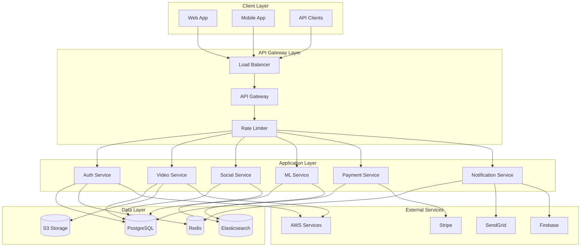
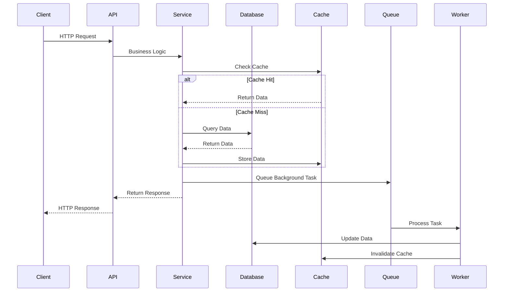

# 📁 Detailed Project Structure

## 🏗️ **System Architecture**



---

## 📁 **Current Repository Layout (Actual)**

The previous version of this document mixed the *planned* long‑term architecture with the *current* codebase. This section now reflects what is **actually present** in the repository today. A later section lists planned / future directories that were previously shown.

```
social-flow-backend/
├── alembic/                      # Database migrations (versions/, env.py)
├── app/                          # FastAPI backend source (modular domains & services)
├── htmlcov/                      # Coverage HTML output
├── logs/                         # Runtime / structured logs
├── results_artifacts/            # Test & analysis result artifacts
├── tests/                        # Pytest tests (integration, advanced, etc.)
├── __pycache__/                  # Python bytecode caches
├── advanced_integration_test.py  # Advanced integration orchestration
├── advanced_test_results.json    # JSON results from advanced test suite
├── AI_ML_ARCHITECTURE.md         # Detailed AI/ML architecture documentation
├── bandit_report.json            # Security static analysis (Bandit) results
├── check_integration.py          # Helper script for integration verification
├── CODE_OF_CONDUCT.md            # Community guidelines
├── COMPLETE_API_DOCUMENTATION.md # Full expanded API reference
├── comprehensive_test.py         # Comprehensive scenario tests
├── conftest.py                   # Pytest fixtures & test configuration
├── docker-compose.yml            # Local dev compose stack
├── docker-compose.production.yml # Production compose stack (correct name)
├── Dockerfile                    # Base application container
├── Dockerfile.production         # Production-optimized Dockerfile
├── env.example                   # Example environment variables
├── FINAL_TESTING_REPORT.md       # Final consolidated test report
├── final_unit_results.txt        # Raw unit test results
├── fix_uuid_conversions.py       # One-off data/UUID fix script
├── LICENSE                       # MIT License
├── Makefile                      # Common dev & quality commands
├── mypy.ini                      # Static typing configuration
├── openapi.yaml                  # Generated/maintained OpenAPI spec
├── postman_collection.json       # Postman collection
├── postman_environment.json      # Postman environment variables
├── PRODUCTION_DEPLOYMENT_GUIDE.md# Production deployment instructions
├── PROJECT_STRUCTURE.md          # (This document)
├── pytest.ini                    # Pytest config
├── README.md                     # Project overview & onboarding
├── requirements.txt              # Prod dependencies
├── requirements-dev.txt          # Dev/test tooling dependencies
├── SECURITY.md                   # Security policy & practices
├── setup-database.ps1            # Windows PowerShell DB setup helper
├── social_flow.db                # SQLite / dev database artifact
├── social_flow_dev.db            # Alternate dev DB
├── START_SERVER_INSTRUCTIONS.md  # Quick start server instructions
├── test.db                       # Test database artifact
├── test_api_endpoints.py         # API endpoint validation script
├── TEST_COMMANDS.md              # Commands cheat‑sheet for testing
├── test_header.txt               # Test header banner / meta
├── test_infrastructure.py        # Infra related tests
├── test_output.txt               # Captured test output log
└── test_infrastructure.py        # (duplicate reference if present – confirm necessity)
```

> NOTE: Some database/test artifacts (e.g., `*.db`, result `.txt` files) are typically excluded in production repos; consider moving them under a dedicated `artifacts/` or ignoring them after CI archiving.

### 🗂️ Key Subdirectory Highlights

| Directory | Purpose |
|-----------|---------|
| `app/` | Core FastAPI application (domains, services, routes, schemas, workers) |
| `alembic/` | Migration environment and versioned migration scripts |
| `tests/` | Test suites (unit/integration/advanced) and Pytest fixtures |
| `results_artifacts/` | Generated reports & analysis results (bandit, coverage, etc.) |
| `htmlcov/` | HTML code coverage output (regenerated) |
| `logs/` | JSON / structured runtime logs |

### 🔍 App Module Enumeration (Current)

Below is a concise inventory of first-level subpackages under `app/` gathered from the repository:

| Module | Notable Subdirs / Files | Purpose (High-Level) |
|--------|-------------------------|----------------------|
| `ai_ml_services/` | content_moderation/, recommendation/, sentiment_analysis/, trending_prediction/, video_analysis/ | High-level orchestration of AI/ML domain-specific services separated by capability cluster |
| `analytics/` | api/, models/, routes/, services/, tasks/, analytics_processing.py | Analytics API routing & processing tasks |
| `ads/` | api/, models/, services/ | Advertisement related domain logic and delivery endpoints |
| `api/` | dependencies.py, v1/ | Root API wiring, dependency injection points, version routing |
| `application/` | services/ | Higher-level application service layer (shared orchestration) |
| `auth/` | api/, application/, domain/, infrastructure/, models/, presentation/, schemas/, services/ | Authentication and identity domain (multi-layered clean architecture layout) |
| `core/` | config*.py, database*.py, redis*.py, logging*.py, security.py, metrics.py, exceptions.py | Cross-cutting platform concerns: configuration, persistence wiring, logging, security primitives |
| `copyright/` | models/, services/ | Copyright / rights management domain |
| `domain/` | entities/, repositories/, value_objects.py | Base domain abstractions & base repository patterns |
| `infrastructure/` | crud/, repositories/, storage/ | Low-level persistence & external integrations |
| `live/` | api/, models/, schemas/, services/ | Live interaction (possibly lightweight vs livestream) |
| `livestream/` | application/, domain/, infrastructure/, models/, presentation/, routes/, services/, websocket/ | Full live streaming feature set including websockets |
| `ml/` | ai_processing.py, api/, ml_tasks.py, schemas/, services/ | ML task entrypoints & lower-level ML services |
| `ml_pipelines/` | batch_processor.py, orchestration & pipeline dirs | Batch & scheduled ML pipeline orchestration (feature eng, training, inference) |
| `models/` | ad.py, base.py, livestream.py, notification.py, payment.py, social.py, types.py, user.py, video.py | Core SQLAlchemy (or Pydantic) domain models aggregated |
| `moderation/` | (init only currently) | Placeholder for future moderation expansion (logic concentrated elsewhere now) |
| `notifications/` | api/, models/, routes/, services/, tasks/, email_processing.py, notification_processing.py, websocket_handler.py | Notification dispatch & processing across channels |
| `payments/` | api/, models/, schemas/, services/ | Payment & billing domain |
| `posts/` | multi-layer (api/, application/, domain/, etc.) | Social posting domain (clean architecture segmentation) |
| `schemas/` | base.py, social.py, user.py, video.py | Shared Pydantic schemas (top-level consolidated) |
| `services/` | recommendation_service.py, search_service.py, storage_service*.py | Shared service layer components reused across domains |
| `shared/` | application/, domain/, infrastructure/ | Shared cross-domain abstractions (pattern library) |
| `tasks/` | (init only) | Placeholder for future globally-scoped task registrations |
| `users/` | api/, models/ | User profile & related operations subset (complementing `auth/`) |
| `videos/` | application/, domain/, infrastructure/, models/, presentation/, routes/, services/, tasks/, video_processing.py, video_tasks.py | Video processing & delivery (encoding, metadata, pipelines) |
| `workers/` | celery_app.py | Celery or background task bootstrap (if present in earlier state) |

> The distinction between `live/` and `livestream/` suggests potential consolidation; consider merging or documenting their separate scopes explicitly in a future refactor.

## 🧭 **Planned / Future Structure (Roadmap)**

The earlier document showed additional infrastructure & documentation folders that do **not yet exist**. They remain part of the roadmap and are retained here for clarity:

Planned directories:

```
docs/            # Consolidated developer & architecture docs
scripts/         # Operational & maintenance scripts (migrations, backups)
.github/workflows# CI/CD pipelines (if migrated from external automation)
k8s/             # Kubernetes manifests (deployment, ingress, hpa, etc.)
terraform/       # Infrastructure as Code for AWS cloud resources
``` 

If/when these are added, this file should be appended—not replaced—so historical context remains.

## 🧪 **Testing Assets (Current)**

Rather than the previously over-detailed hypothetical breakdown, present state focuses on implemented test orchestration scripts and reports:

- `advanced_integration_test.py` – Composite integration scenario runner
- `comprehensive_test.py` – Broad functional coverage harness
- `FINAL_TESTING_REPORT.md` – Curated human-readable summary
- `advanced_test_results.json` / `final_unit_results.txt` – Raw machine outputs
- `bandit_report.json` – Static security scan output
- `htmlcov/` – Regenerated code coverage

## 🔄 **Differences From Previous Version of This Document**

| Category | Previous File Claimed | Actual Status | Action Taken |
|----------|-----------------------|---------------|--------------|
| Docker compose | `docker-compose.prod.yml` | Real file is `docker-compose.production.yml` | Corrected reference |
| Docs folders | `docs/` tree | Not present | Moved to "Planned" section |
| Infra folders | `k8s/`, `terraform/`, `.github/workflows` | Not present | Marked as roadmap |
| Extra guides | Multiple (`TESTING.md`, `MONITORING.md`, etc.) | Not present | Removed from current list; can be created later |
| API doc file | `API_DOCUMENTATION.md` | File name is `COMPLETE_API_DOCUMENTATION.md` | Corrected |
| Flutter guide | `FLUTTER_INTEGRATION.md` | Not present | Removed (re-add when file exists) |
| Testing guide link | Non-existent `PHASE_7_8_TESTING_GUIDE.md` | Broken reference in README | Will be fixed in README |

## 📊 **Updated Project Statistics (Realistic)**

| Category | Approx Count | Notes |
|----------|--------------|-------|
| Directories | 15+ | Core app modules, migrations, tests, artifacts |
| Python files | 100+ | Application + tests combined |
| Test scripts | 10+ | Plus generated result artifacts |
| Markdown docs | 10 | Core high-value docs only so far |
| Config / tooling | 8+ | mypy, pytest, docker, compose, Makefile, env example |

> As the project matures, regenerate counts via an automated script (e.g., `make stats`) and embed them here.

## ✅ **Next Maintenance Suggestions**

1. Create a `docs/` directory and migrate large markdown files into thematic sections.
2. Add a lightweight `CHANGELOG.md` starting from current commit baseline.
3. Introduce `scripts/` for operational helpers currently at root.
4. Add automation to produce `PROJECT_STRUCTURE.md` (partial) via a script to reduce drift.
5. Archive or ignore transient artifacts (`*.db`, raw test output) after CI capture.

---

The sections below (Architecture Patterns, Data Flow, Design Principles) are retained from the original document and remain valid.

## 📊 **Project Statistics**

| **Category** | **Count** | **Description** |
|--------------|-----------|-----------------|
| **📁 Directories** | 25+ | Well-organized folder structure |
| **📄 Python Files** | 100+ | Core application code |
| **🧪 Test Files** | 50+ | Comprehensive test coverage |
| **📚 Documentation** | 20+ | Extensive documentation |
| **⚙️ Configuration** | 15+ | Various config files |
| **🚀 Scripts** | 10+ | Utility and automation scripts |
| **📦 Dependencies** | 50+ | Production and development packages |
| **🔧 Tools** | 10+ | Development and deployment tools |

## 🏗️ **Architecture Patterns**

- **🎯 Domain-Driven Design (DDD)**: Clear separation of business logic
- **🔧 Dependency Injection**: Loose coupling and testability
- **📡 Repository Pattern**: Data access abstraction
- **🏭 Factory Pattern**: Object creation management
- **📋 Command Pattern**: Request handling and queuing
- **👀 Observer Pattern**: Event-driven architecture
- **🔄 Strategy Pattern**: Algorithm selection and execution
- **🛡️ Decorator Pattern**: Middleware and cross-cutting concerns

## 🔄 **Data Flow**



## 🎯 **Key Design Principles**

1. **🔒 Security First**: Every component designed with security in mind
2. **⚡ Performance Optimized**: Built for high performance and scalability
3. **🧪 Test Driven**: Comprehensive testing at all levels
4. **📚 Well Documented**: Extensive documentation for all components
5. **🔄 Maintainable**: Clean, modular, and maintainable code
6. **🌐 Scalable**: Designed to handle millions of users
7. **🔧 Configurable**: Highly configurable for different environments
8. **📊 Observable**: Comprehensive monitoring and logging
