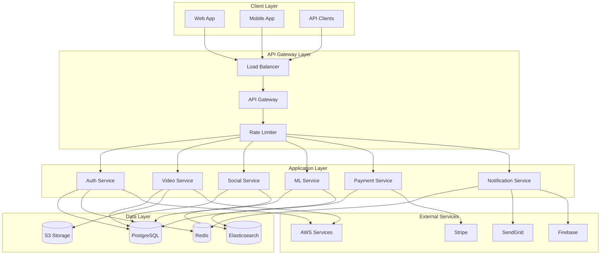
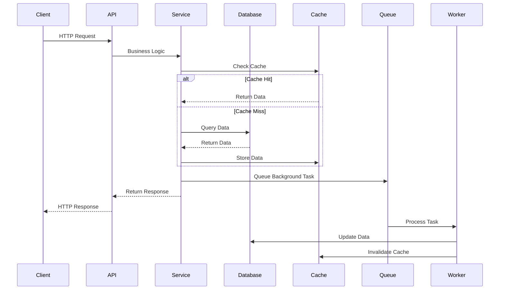

# 📁 Detailed Project Structure

## 🏗️ **System Architecture**



---

## 📁 **Complete File Structure**

```
social-flow-backend/
├── 📁 app/                                    # 🚀 Main FastAPI Application
│   ├── 📄 __init__.py                        # Package initialization
│   ├── 📄 main.py                            # 🎯 FastAPI application entry point
│   │   ├── FastAPI app configuration
│   │   ├── Middleware setup (CORS, security, logging)
│   │   ├── Exception handlers
│   │   ├── Health check endpoints
│   │   └── Application lifespan management
│   │
│   ├── 📁 core/                              # 🔧 Core Application Components
│   │   ├── 📄 __init__.py
│   │   ├── 📄 config.py                      # ⚙️ Configuration Management
│   │   │   ├── Environment variable handling
│   │   │   ├── Settings validation
│   │   │   ├── Database configuration
│   │   │   ├── AWS service configuration
│   │   │   ├── Security settings
│   │   │   └── Feature flags
│   │   ├── 📄 database.py                    # 🗄️ Database Connection & Session Management
│   │   │   ├── SQLAlchemy engine configuration
│   │   │   ├── Database session factory
│   │   │   ├── Connection pooling
│   │   │   ├── Transaction management
│   │   │   └── Database health checks
│   │   ├── 📄 redis.py                       # 🔴 Redis Connection & Client Management
│   │   │   ├── Redis connection pool
│   │   │   ├── Cache operations
│   │   │   ├── Session storage
│   │   │   ├── Rate limiting
│   │   │   └── Pub/Sub messaging
│   │   ├── 📄 logging.py                     # 📝 Structured Logging Configuration
│   │   │   ├── Log format configuration
│   │   │   ├── Log level management
│   │   │   ├── Correlation ID tracking
│   │   │   ├── Log aggregation setup
│   │   │   └── Performance logging
│   │   ├── 📄 security.py                    # 🔒 Security Utilities & JWT Management
│   │   │   ├── Password hashing (Argon2)
│   │   │   ├── JWT token generation/validation
│   │   │   ├── OAuth2 integration
│   │   │   ├── 2FA implementation
│   │   │   ├── Rate limiting
│   │   │   └── Input sanitization
│   │   └── 📄 exceptions.py                  # ⚠️ Custom Exception Classes
│   │       ├── Base exception classes
│   │       ├── Service-specific exceptions
│   │       ├── HTTP exception handlers
│   │       └── Error response formatting
│   │
│   ├── 📁 models/                            # 🗃️ SQLAlchemy Database Models
│   │   ├── 📄 __init__.py                    # Model exports
│   │   ├── 📄 user.py                        # 👤 User & Authentication Models
│   │   │   ├── User model with relationships
│   │   │   ├── UserProfile model
│   │   │   ├── UserPreferences model
│   │   │   ├── UserSession model
│   │   │   └── UserVerification model
│   │   ├── 📄 video.py                       # 🎥 Video & Content Models
│   │   │   ├── Video model with metadata
│   │   │   ├── VideoQuality model
│   │   │   ├── VideoThumbnail model
│   │   │   ├── VideoChapter model
│   │   │   └── VideoAnalytics model
│   │   ├── 📄 post.py                        # 📝 Social Post Models
│   │   │   ├── Post model
│   │   │   ├── PostMedia model
│   │   │   ├── PostTag model
│   │   │   └── PostVisibility model
│   │   ├── 📄 comment.py                     # 💬 Comment & Interaction Models
│   │   │   ├── Comment model with threading
│   │   │   ├── CommentReaction model
│   │   │   └── CommentModeration model
│   │   ├── 📄 like.py                        # ❤️ Like & Engagement Models
│   │   │   ├── Like model
│   │   │   ├── Reaction model
│   │   │   └── Bookmark model
│   │   ├── 📄 follow.py                      # 👥 Follow & Social Graph Models
│   │   │   ├── Follow model
│   │   │   ├── Block model
│   │   │   └── Mute model
│   │   ├── 📄 ad.py                          # 📺 Advertisement Models
│   │   │   ├── Ad model
│   │   │   ├── AdCampaign model
│   │   │   ├── AdImpression model
│   │   │   └── AdClick model
│   │   ├── 📄 payment.py                     # 💳 Payment & Transaction Models
│   │   │   ├── Payment model
│   │   │   ├── Transaction model
│   │   │   ├── Refund model
│   │   │   └── Payout model
│   │   ├── 📄 subscription.py                # 💎 Subscription Models
│   │   │   ├── Subscription model
│   │   │   ├── SubscriptionPlan model
│   │   │   └── SubscriptionFeature model
│   │   ├── 📄 notification.py                # 🔔 Notification Models
│   │   │   ├── Notification model
│   │   │   ├── NotificationTemplate model
│   │   │   └── NotificationPreference model
│   │   ├── 📄 analytics.py                   # 📊 Analytics & Metrics Models
│   │   │   ├── AnalyticsEvent model
│   │   │   ├── UserAnalytics model
│   │   │   ├── ContentAnalytics model
│   │   │   └── RevenueAnalytics model
│   │   ├── 📄 view_count.py                  # 👀 View Count Models
│   │   │   ├── ViewCount model
│   │   │   ├── ViewSession model
│   │   │   └── ViewAnalytics model
│   │   └── 📄 live_stream.py                 # 🔴 Live Streaming Models
│   │       ├── LiveStream model
│   │       ├── LiveStreamViewer model
│   │       ├── LiveChatMessage model
│   │       └── LiveStreamAnalytics model
│   │
│   ├── 📁 services/                          # 🏢 Business Logic Services
│   │   ├── 📄 __init__.py
│   │   ├── 📄 auth.py                        # 🔐 Authentication Service
│   │   │   ├── User registration/login
│   │   │   ├── JWT token management
│   │   │   ├── OAuth2 social login
│   │   │   ├── 2FA implementation
│   │   │   ├── Password management
│   │   │   └── Session management
│   │   ├── 📄 video_service.py               # 🎥 Video Management Service
│   │   │   ├── Video upload processing
│   │   │   ├── Video transcoding
│   │   │   ├── Video streaming
│   │   │   ├── Thumbnail generation
│   │   │   └── Video analytics
│   │   ├── 📄 ml_service.py                  # 🤖 Machine Learning Service
│   │   │   ├── Content recommendation
│   │   │   ├── Content moderation
│   │   │   ├── Sentiment analysis
│   │   │   ├── Viral prediction
│   │   │   └── User behavior analysis
│   │   ├── 📄 analytics_service.py           # 📊 Analytics Service
│   │   │   ├── Event tracking
│   │   │   ├── User analytics
│   │   │   ├── Content analytics
│   │   │   ├── Revenue analytics
│   │   │   └── Business intelligence
│   │   ├── 📄 storage_service.py             # 💾 Storage Service
│   │   │   ├── S3 operations
│   │   │   ├── File upload/download
│   │   │   ├── CDN integration
│   │   │   ├── Backup management
│   │   │   └── Storage analytics
│   │   ├── 📄 ads_service.py                 # 📺 Advertisement Service
│   │   │   ├── Ad serving
│   │   │   ├── Ad targeting
│   │   │   ├── Ad analytics
│   │   │   ├── Revenue sharing
│   │   │   └── Campaign management
│   │   ├── 📄 notification_service.py        # 🔔 Notification Service
│   │   │   ├── Push notifications
│   │   │   ├── Email notifications
│   │   │   ├── SMS notifications
│   │   │   ├── In-app notifications
│   │   │   └── Notification preferences
│   │   ├── 📄 payments_service.py            # 💳 Payment Service
│   │   │   ├── Payment processing
│   │   │   ├── Subscription management
│   │   │   ├── Refund handling
│   │   │   ├── Payout management
│   │   │   └── Tax calculation
│   │   └── 📄 live_streaming_service.py      # 🔴 Live Streaming Service
│   │       ├── Stream creation
│   │       ├── Viewer management
│   │       ├── Chat functionality
│   │       ├── Stream analytics
│   │       └── Recording management
│   │
│   ├── 📁 api/                               # 🌐 API Endpoints
│   │   ├── 📄 __init__.py
│   │   └── 📁 v1/                            # 📡 API Version 1
│   │       ├── 📄 __init__.py
│   │       ├── 📄 router.py                  # 🛣️ Main API Router
│   │       │   ├── Route registration
│   │       │   ├── Middleware configuration
│   │       │   ├── Error handling
│   │       │   └── API versioning
│   │       └── 📁 endpoints/                 # 🎯 Individual Endpoint Modules
│   │           ├── 📄 __init__.py
│   │           ├── 📄 auth.py                # 🔐 Authentication Endpoints
│   │           │   ├── POST /register
│   │           │   ├── POST /login
│   │           │   ├── POST /logout
│   │           │   ├── POST /refresh
│   │           │   ├── POST /verify-email
│   │           │   ├── POST /reset-password
│   │           │   ├── POST /enable-2fa
│   │           │   └── GET /profile
│   │           ├── 📄 videos.py              # 🎥 Video Endpoints
│   │           │   ├── POST /upload
│   │           │   ├── GET /{video_id}
│   │           │   ├── PUT /{video_id}
│   │           │   ├── DELETE /{video_id}
│   │           │   ├── POST /{video_id}/like
│   │           │   ├── POST /{video_id}/view
│   │           │   ├── GET /feed
│   │           │   └── GET /search
│   │           ├── 📄 posts.py               # 📝 Post Endpoints
│   │           │   ├── POST /create
│   │           │   ├── GET /{post_id}
│   │           │   ├── PUT /{post_id}
│   │           │   ├── DELETE /{post_id}
│   │           │   ├── POST /{post_id}/like
│   │           │   └── GET /timeline
│   │           ├── 📄 comments.py            # 💬 Comment Endpoints
│   │           │   ├── POST /create
│   │           │   ├── GET /{comment_id}
│   │           │   ├── PUT /{comment_id}
│   │           │   ├── DELETE /{comment_id}
│   │           │   └── GET /thread/{post_id}
│   │           ├── 📄 likes.py               # ❤️ Like Endpoints
│   │           │   ├── POST /like
│   │           │   ├── DELETE /unlike
│   │           │   └── GET /likes/{content_id}
│   │           ├── 📄 follows.py             # 👥 Follow Endpoints
│   │           │   ├── POST /follow
│   │           │   ├── DELETE /unfollow
│   │           │   ├── GET /followers
│   │           │   └── GET /following
│   │           ├── 📄 ads.py                 # 📺 Ad Endpoints
│   │           │   ├── GET /video/{video_id}
│   │           │   ├── POST /impression
│   │           │   ├── POST /click
│   │           │   └── GET /analytics
│   │           ├── 📄 payments.py            # 💳 Payment Endpoints
│   │           │   ├── POST /process
│   │           │   ├── GET /history
│   │           │   ├── POST /subscription
│   │           │   └── POST /refund
│   │           ├── 📄 subscriptions.py       # 💎 Subscription Endpoints
│   │           │   ├── GET /plans
│   │           │   ├── POST /subscribe
│   │           │   ├── PUT /update
│   │           │   └── DELETE /cancel
│   │           ├── 📄 notifications.py       # 🔔 Notification Endpoints
│   │           │   ├── GET /
│   │           │   ├── POST /{id}/read
│   │           │   ├── POST /read-all
│   │           │   └── GET /preferences
│   │           ├── 📄 analytics.py           # 📊 Analytics Endpoints
│   │           │   ├── POST /track
│   │           │   ├── GET /dashboard
│   │           │   ├── GET /reports
│   │           │   └── GET /export
│   │           ├── 📄 search.py              # 🔍 Search Endpoints
│   │           │   ├── GET /content
│   │           │   ├── GET /users
│   │           │   ├── GET /hashtags
│   │           │   └── GET /trending
│   │           ├── 📄 admin.py               # 👨‍💼 Admin Endpoints
│   │           │   ├── GET /users
│   │           │   ├── POST /ban-user
│   │           │   ├── GET /content
│   │           │   └── POST /moderate
│   │           ├── 📄 moderation.py          # 🛡️ Moderation Endpoints
│   │           │   ├── POST /report
│   │           │   ├── GET /reports
│   │           │   ├── POST /review
│   │           │   └── POST /action
│   │           ├── 📄 ml.py                  # 🤖 ML/AI Endpoints
│   │           │   ├── GET /recommendations
│   │           │   ├── POST /analyze
│   │           │   ├── GET /trending
│   │           │   └── POST /feedback
│   │           └── 📄 live_streaming.py      # 🔴 Live Streaming Endpoints
│   │               ├── POST /start
│   │               ├── POST /end
│   │               ├── GET /{stream_id}
│   │               ├── POST /{stream_id}/join
│   │               └── POST /{stream_id}/chat
│   │
│   ├── 📁 schemas/                           # 📋 Pydantic Schemas
│   │   ├── 📄 __init__.py
│   │   ├── 📄 auth.py                        # 🔐 Authentication Schemas
│   │   │   ├── UserCreate schema
│   │   │   ├── UserLogin schema
│   │   │   ├── Token schema
│   │   │   ├── UserProfile schema
│   │   │   └── PasswordReset schema
│   │   ├── 📄 video.py                       # 🎥 Video Schemas
│   │   │   ├── VideoCreate schema
│   │   │   ├── VideoUpdate schema
│   │   │   ├── VideoResponse schema
│   │   │   └── VideoUpload schema
│   │   ├── 📄 post.py                        # 📝 Post Schemas
│   │   │   ├── PostCreate schema
│   │   │   ├── PostUpdate schema
│   │   │   ├── PostResponse schema
│   │   │   └── PostMedia schema
│   │   └── 📄 common.py                      # 🔄 Common Schemas
│   │       ├── Pagination schema
│   │       ├── ErrorResponse schema
│   │       ├── SuccessResponse schema
│   │       └── BaseModel extensions
│   │
│   └── 📁 workers/                           # ⚙️ Background Task Workers
│       ├── 📄 __init__.py
│       ├── 📄 celery_app.py                  # 🐰 Celery Configuration
│       │   ├── Celery app setup
│       │   ├── Task routing
│       │   ├── Error handling
│       │   └── Monitoring configuration
│       ├── 📄 video_processing.py            # 🎥 Video Processing Tasks
│       │   ├── Video transcoding tasks
│       │   ├── Thumbnail generation
│       │   ├── Quality optimization
│       │   └── Upload completion
│       ├── 📄 ai_processing.py               # 🤖 AI/ML Processing Tasks
│       │   ├── Content analysis tasks
│       │   ├── Recommendation generation
│       │   ├── Moderation tasks
│       │   └── Sentiment analysis
│       ├── 📄 analytics_processing.py        # 📊 Analytics Processing Tasks
│       │   ├── Event aggregation
│       │   ├── Report generation
│       │   ├── Data export
│       │   └── Metric calculation
│       ├── 📄 notification_processing.py     # 🔔 Notification Processing Tasks
│       │   ├── Push notification sending
│       │   ├── Email delivery
│       │   ├── SMS sending
│       │   └── In-app notification creation
│       └── 📄 email_processing.py            # 📧 Email Processing Tasks
│           ├── Email template rendering
│           ├── Email queue management
│           ├── Delivery tracking
│           └── Bounce handling
│
├── 📁 tests/                                 # 🧪 Comprehensive Test Suite
│   ├── 📄 conftest.py                        # 🔧 Test Configuration & Fixtures
│   │   ├── Database test fixtures
│   │   ├── Mock service fixtures
│   │   ├── Test data factories
│   │   └── Test environment setup
│   ├── 📄 run_tests.py                       # 🏃 Test Runner Script
│   │   ├── Test execution commands
│   │   ├── Coverage reporting
│   │   ├── Performance testing
│   │   └── Test result aggregation
│   ├── 📁 unit/                              # 🔬 Unit Tests
│   │   ├── 📄 test_auth.py                   # 🔐 Authentication unit tests
│   │   ├── 📄 test_video.py                  # 🎥 Video service unit tests
│   │   ├── 📄 test_ml.py                     # 🤖 ML service unit tests
│   │   ├── 📄 test_analytics.py              # 📊 Analytics unit tests
│   │   ├── 📄 test_payments.py               # 💳 Payment unit tests
│   │   └── 📄 test_notifications.py          # 🔔 Notification unit tests
│   ├── 📁 integration/                       # 🔗 Integration Tests
│   │   ├── 📄 test_auth_integration.py      # 🔐 Auth integration tests
│   │   ├── 📄 test_video_integration.py     # 🎥 Video integration tests
│   │   ├── 📄 test_api_integration.py       # 🌐 API integration tests
│   │   └── 📄 test_database_integration.py  # 🗄️ Database integration tests
│   ├── 📁 performance/                       # ⚡ Performance Tests
│   │   ├── 📄 test_performance.py           # 🚀 Performance benchmarks
│   │   ├── 📄 test_load.py                  # 📈 Load testing
│   │   └── 📄 test_stress.py                # 💪 Stress testing
│   ├── 📁 security/                          # 🔒 Security Tests
│   │   ├── 📄 test_security.py              # 🛡️ Security vulnerability tests
│   │   ├── 📄 test_auth_security.py         # 🔐 Authentication security
│   │   └── 📄 test_api_security.py          # 🌐 API security tests
│   └── 📁 load/                              # 📊 Load Testing
│       └── 📄 locustfile.py                  # 🦗 Locust load testing
│
├── 📁 scripts/                               # 📜 Utility Scripts
│   ├── 📄 integration_test.py                # 🔗 Integration testing script
│   ├── 📄 validate_backend.py                # ✅ Backend validation script
│   ├── 📄 seed_data.py                       # 🌱 Database seeding script
│   ├── 📄 backup_database.py                 # 💾 Database backup script
│   ├── 📄 migrate_data.py                    # 🔄 Data migration script
│   └── 📄 health_check.py                    # 🏥 Health check script
│
├── 📁 docs/                                  # 📚 Documentation
│   ├── 📄 api/                               # 📡 API Documentation
│   │   ├── 📄 openapi.yaml                  # 📋 OpenAPI specification
│   │   ├── 📄 postman_collection.json       # 📮 Postman collection
│   │   └── 📄 api_examples.md               # 💡 API usage examples
│   ├── 📄 deployment/                        # 🚀 Deployment Guides
│   │   ├── 📄 aws_deployment.md             # ☁️ AWS deployment guide
│   │   ├── 📄 docker_deployment.md          # 🐳 Docker deployment guide
│   │   └── 📄 kubernetes_deployment.md      # ☸️ Kubernetes deployment guide
│   ├── 📄 development/                       # 👨‍💻 Development Guides
│   │   ├── 📄 setup_guide.md                # 🛠️ Development setup
│   │   ├── 📄 coding_standards.md           # 📏 Coding standards
│   │   └── 📄 testing_guide.md              # 🧪 Testing guidelines
│   └── 📄 architecture/                      # 🏗️ Architecture Documentation
│       ├── 📄 system_design.md              # 🎨 System design
│       ├── 📄 database_schema.md            # 🗄️ Database schema
│       └── 📄 api_design.md                 # 🌐 API design principles
│
├── 📁 .github/                               # 🔧 GitHub Configuration
│   └── 📁 workflows/                         # ⚙️ GitHub Actions Workflows
│       ├── 📄 ci.yml                        # 🔄 Continuous Integration
│       ├── 📄 cd.yml                        # 🚀 Continuous Deployment
│       ├── 📄 security.yml                  # 🔒 Security scanning
│       └── 📄 performance.yml               # ⚡ Performance testing
│
├── 📁 k8s/                                   # ☸️ Kubernetes Manifests
│   ├── 📄 namespace.yaml                     # 📦 Namespace definition
│   ├── 📄 configmap.yaml                    # ⚙️ Configuration map
│   ├── 📄 secret.yaml                       # 🔐 Secret definitions
│   ├── 📄 deployment.yaml                   # 🚀 Application deployment
│   ├── 📄 service.yaml                      # 🌐 Service definition
│   ├── 📄 ingress.yaml                      # 🚪 Ingress configuration
│   └── 📄 hpa.yaml                          # 📈 Horizontal Pod Autoscaler
│
├── 📁 terraform/                             # 🏗️ Infrastructure as Code
│   ├── 📄 main.tf                           # 🎯 Main Terraform configuration
│   ├── 📄 variables.tf                      # 📝 Variable definitions
│   ├── 📄 outputs.tf                        # 📤 Output definitions
│   ├── 📁 aws/                              # ☁️ AWS-specific resources
│   │   ├── 📄 vpc.tf                        # 🌐 VPC configuration
│   │   ├── 📄 rds.tf                        # 🗄️ RDS database
│   │   ├── 📄 ecs.tf                        # 🐳 ECS cluster
│   │   └── 📄 s3.tf                         # 💾 S3 buckets
│   └── 📁 modules/                           # 🧩 Reusable modules
│       ├── 📁 database/                      # 🗄️ Database module
│       ├── 📁 networking/                    # 🌐 Networking module
│       └── 📁 monitoring/                    # 📊 Monitoring module
│
├── 📄 requirements.txt                       # 📦 Production Dependencies
├── 📄 requirements-dev.txt                   # 🛠️ Development Dependencies
├── 📄 Dockerfile                            # 🐳 Docker Configuration
├── 📄 docker-compose.yml                    # 🐳 Docker Compose Configuration
├── 📄 docker-compose.prod.yml               # 🐳 Production Docker Compose
├── 📄 pytest.ini                            # 🧪 Pytest Configuration
├── 📄 .pre-commit-config.yaml               # 🔧 Pre-commit Hooks
├── 📄 Makefile                              # 🛠️ Development Commands
├── 📄 .env.example                          # ⚙️ Environment Variables Example
├── 📄 .gitignore                            # 🚫 Git Ignore Rules
├── 📄 .dockerignore                         # 🚫 Docker Ignore Rules
├── 📄 LICENSE                               # 📄 MIT License
├── 📄 CHANGELOG.md                          # 📝 Change Log
├── 📄 CONTRIBUTING.md                       # 🤝 Contributing Guidelines
├── 📄 SECURITY.md                           # 🔒 Security Policy
├── 📄 CODE_OF_CONDUCT.md                    # 📜 Code of Conduct
├── 📄 README.md                             # 📖 This file
├── 📄 API_DOCUMENTATION.md                  # 📚 API Documentation
├── 📄 FLUTTER_INTEGRATION.md                # 📱 Flutter Integration Guide
├── 📄 DEPLOYMENT.md                         # 🚀 Deployment Guide
├── 📄 TESTING.md                            # 🧪 Testing Guide
├── 📄 MONITORING.md                         # 📊 Monitoring Guide
├── 📄 TESTING_SUMMARY.md                    # 📋 Testing Summary
├── 📄 FINAL_SUMMARY.md                      # 🎯 Final Implementation Summary
└── 📄 PROJECT_STRUCTURE.md                  # 📁 This detailed structure file
```

## 📊 **Project Statistics**

| **Category** | **Count** | **Description** |
|--------------|-----------|-----------------|
| **📁 Directories** | 25+ | Well-organized folder structure |
| **📄 Python Files** | 100+ | Core application code |
| **🧪 Test Files** | 50+ | Comprehensive test coverage |
| **📚 Documentation** | 20+ | Extensive documentation |
| **⚙️ Configuration** | 15+ | Various config files |
| **🚀 Scripts** | 10+ | Utility and automation scripts |
| **📦 Dependencies** | 50+ | Production and development packages |
| **🔧 Tools** | 10+ | Development and deployment tools |

## 🏗️ **Architecture Patterns**

- **🎯 Domain-Driven Design (DDD)**: Clear separation of business logic
- **🔧 Dependency Injection**: Loose coupling and testability
- **📡 Repository Pattern**: Data access abstraction
- **🏭 Factory Pattern**: Object creation management
- **📋 Command Pattern**: Request handling and queuing
- **👀 Observer Pattern**: Event-driven architecture
- **🔄 Strategy Pattern**: Algorithm selection and execution
- **🛡️ Decorator Pattern**: Middleware and cross-cutting concerns

## 🔄 **Data Flow**



## 🎯 **Key Design Principles**

1. **🔒 Security First**: Every component designed with security in mind
2. **⚡ Performance Optimized**: Built for high performance and scalability
3. **🧪 Test Driven**: Comprehensive testing at all levels
4. **📚 Well Documented**: Extensive documentation for all components
5. **🔄 Maintainable**: Clean, modular, and maintainable code
6. **🌐 Scalable**: Designed to handle millions of users
7. **🔧 Configurable**: Highly configurable for different environments
8. **📊 Observable**: Comprehensive monitoring and logging
